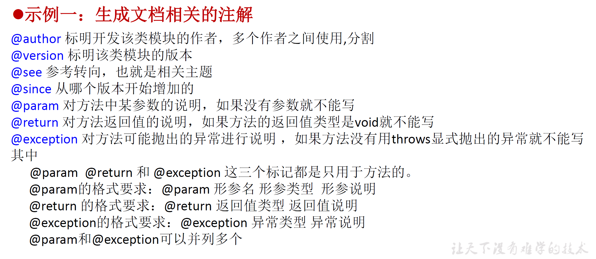
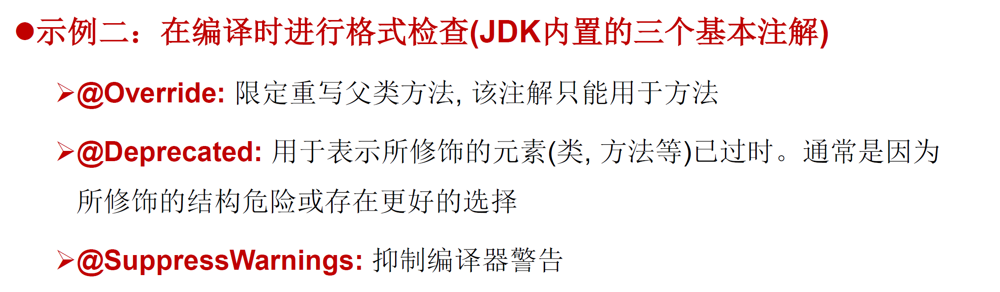
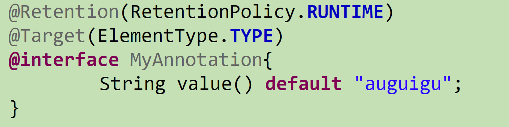
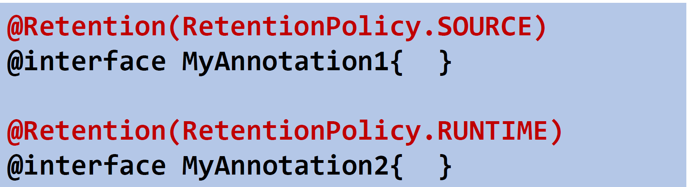
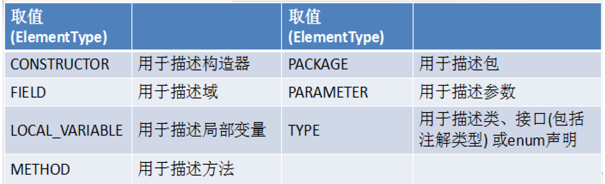
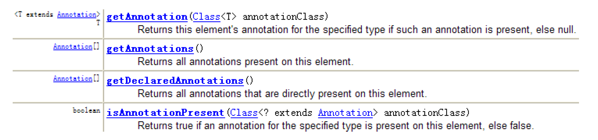

# 注释类型
```
单行注释：//
多行注释：/* */
文档注释：/** */，Java特有的注释，注释内容会被JDC提供的工具javadoc所解析，生成一套以网页文件形式体现的该程序的说明文档
通过javadoc -d 文档名 -author -version 文件名
的形式自动生成说明文档
```

# 注解(Annotation)
```
概述：
1.从JDK5.0开始，Java增加了对元数据(MetaData)的支持，也就是注解
2.Annotation是代码里的特殊标记，可以在编译，类加载，运行时被读取，并执行相应的处理，通过Annotation可以在不改变原有逻辑的情况下，在源文件中嵌入一些补充信息。代码分析工具、开发工具和部署工具可以通过这些补充信息进行验证或者进行部署
3.Annotation可以像修饰符一样被使用，用于修饰包，类，构造器，方法，成员，参数，局部变量的声明，这些信息保存在Annotation的"name=value"中
4.在JavaSE中注解简单，在JavaEE中可以用来配置应用的任何切面，未来开发模式JPA，SPRING2.5，Hibernate3.x都是基于注解的，可以说
框架 = 注解+反射+设计模式
```

# 生成文档注解


# 编译时格式检查


# 自定义Annotation
```
1.使用@interface关键字修饰：@interface name{}
2.自定义注解自动继承了java.lang.annotation.Annotation接口
3.成员变量以无参数方法的形式声明，方法名和返回值定义了该成员的名字和类型，类型只能是八种基本数据类型，String，Class，enum，Annotation以上所有类型的数组
4.可以在定义成员变量时指定初始值，指定成员变量的初始值可以使用default关键字
5.如果只有一个参数成员，建议参数名为value
6.如果注解含有配置参数，则定义时必须指定参数值，格式为 参数名=数值
7.没有成员的定义为标记，有成员变量的为元数据Annotation
```
例子：


# 元注解
用于修饰其他Annotation的定义  
四个标准meta-annotation：
```
Retention：指定生命周期
Target：指定被修饰的Annotation能用于修饰哪些元素
Documented：被修饰的Annotation类将被javadoc工具提取成文档，默认情况下javadoc是不包括注解的，定义为Documented的注解必须设置为Retention的RUNTIME
Inherited：被修饰的Annotation将具有继承性
```
Retention：
```
RetentionPolicy.SOURCE：在源文件中有效（即源文件保留）编译器直接丢弃这种策略的注释
RetentionPolicy.CLASS：在class文件中有效（即class保留）当运行Java程序时,JVM不会保留注解。这是默认值
RetentionPolicy.RUNTIME：在运行时有效（即运行时保留当运行Java程时,JVM会保留注释。程序可以通过反射获取该注释。
```

Target:


# 利用反射获取注解信息
```
JDK5.0在java.lang.reflect包下新增AnnotationElement接口，代表程序中可以接收注解的程序元素
当被设置为运行时Annotation时，在class文件被载入时Annotation会被虚拟机读取，程序可以调用AnnotationElement的方法访问Annotation的信息
```


# JDK8中注解的新特性
1.<font color=red> 可重复的注解</font>
2.<font color=red> 可用于类型的注解</font>   
ElementType多了两个类型：  
TYPE_PARAMENTER：注解能写在类型变量的声明语句中  
TYPE_USE：可以在使用类型的任何语句中