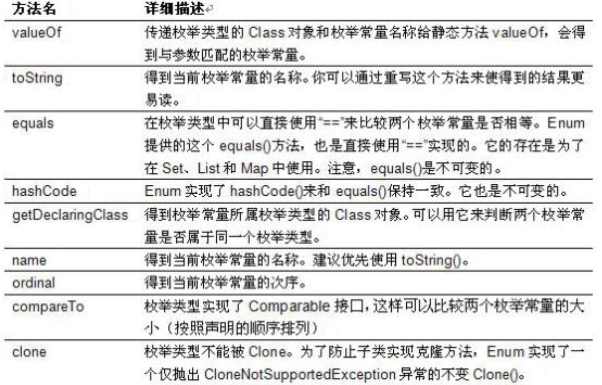

# 自定义枚举类
```
1.私有化类的构造器，保证不能在类外部创建其对象；
2.在类的内部创建枚举类实例，声明为public static final
3.如果对象有实例变量，应声明为private final，并在构造器中初始化
例如：
class Season{
    private final String SEASONNAME;
    private final String SEASONDESC;
    private Season(String seasonName, String seasonDesc){
        this.SEASONNAME = seasonName;
        this.SEASONDESC = seasonDesc;
    }
    public static final Season SPRING = new Season( 春天 "", 春暖花开);
    public static final Season SUMMER = new Season( 夏天 "", 夏日炎炎);
    public static final Season AUTUMN = new Season( 秋天 "", 秋高气爽);
    public static final Season WINTER = new Season( 冬天 "", 白雪皑皑);
}
```

# 使用enum定义枚举类（JDK1.5）
```
1.使用enum定义的枚举类默认继承了java.lang.Enum类，因此不能再继承其他类
2.只能使用private修饰
3.所有实例必须在类中显示列出，会自动加上public static final
4.必须在枚举类的第一行声明枚举类对象
JDK1.5可以在switch表达式中使用Enum定义枚举类的对象作为表达式
例子：
class Season{
    SPRING("春天","春风又绿江南岸")
    SUMMER("夏天","映日荷花别样红")
    AUTUMN("秋天","秋水共长天一色")
    WINTER("冬天","窗含西岭千秋雪")

    private final String SEASONNAME;
    private final String SEASONDESC;
    private Season(String seasonName, String seasonDesc){
        this.SEASONNAME = seasonName;
        this.SEASONDESC = seasonDesc;
    }
    public String getSeasonName() {
        return seasonName;
    }
    public String getSeasonDesc() {
        return seasonDesc;
    }
}
```

# enum类常用方法

