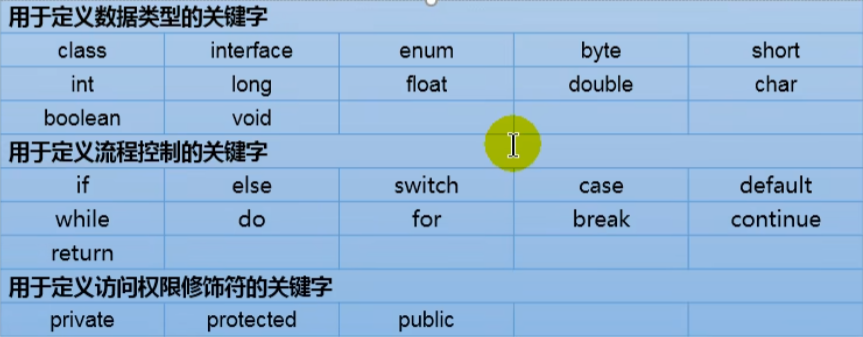
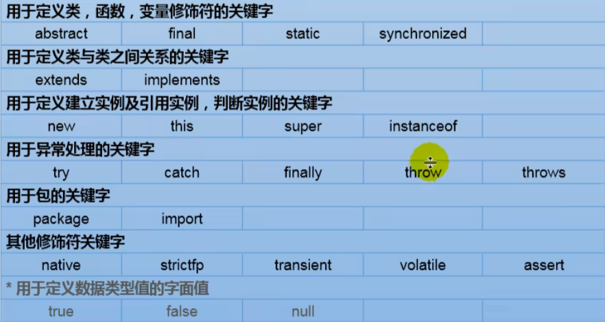
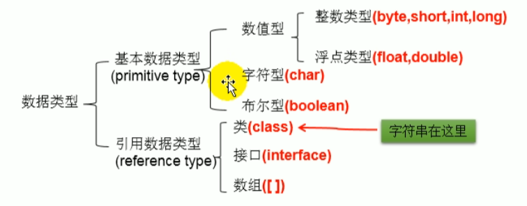
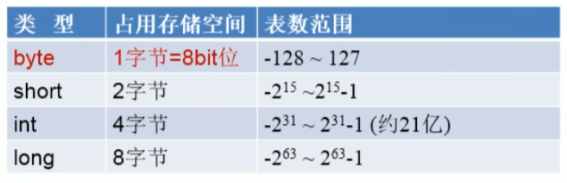
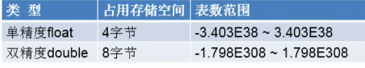
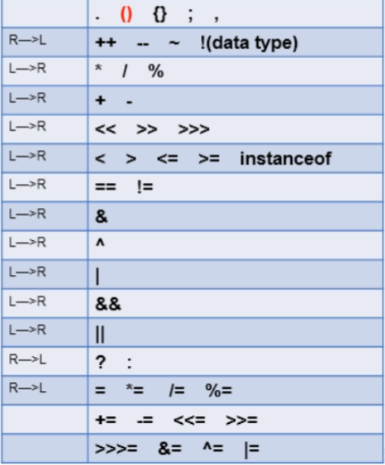

# 关键字（keyword）和保留字（reserved word）
```
关键字：
被Java赋予了特殊含义，用于专门用途的字符串
特点：关键字所有字母都为小写

保留字：
现有Java版本尚未使用，但是以后版本可能会作为关键字使用，所以命名时也要避免使用保留字
goto、const
```



# 标识符（identifier）
```
标识符：Java对各种变量、方法和类等要素命名时使用的字符序列
定义规则：
1.由英文，数字，_或$组成
2.不可以数字开头
3.不直接使用关键字和保留字，但可以包含
4.严格区分大小写
5.不能含有空格
```

# 命名规范
```
包名：多单词组成时所有字母小写，如xxyyzz
类名、接口名：多单词组成时所有单词首字母大写，如XxxYyyZzz
变量名、方法名：多单词组成时，第一个单词首字母小写，第二个单词开始每个单词首字母大写，如xxYyZz
常量名：所有字母大写，多单词时每个单词用下划线连接，如XXX_YYY_ZZZ
ps：标识符能够使用中文命名，但是不建议使用
```

# 变量


# 整数类型byte，shot，int，long
```
Java各数据类型有固定的表数范围和字段长度，不受OS影响，以保证Java的可移植性
Java的整型常量默认为int型，声明long型常量需要后面加l或L
```


# 浮点类型float，double
```
浮点型常量的两种表达方式：
1.十进制，如5.12，.512
2.科学计数法，如512E2,100E-2
float:单精度，尾数精确到7位有效数字
double：双精度，精度是float的两倍，通常采用此类型
Java浮点型常量默认是double,声明float常量需要后面加f或F
```


# 字符类型char
```
2字节
Java中所有字符都使用Unicode编码，故一个字符可以储存汉字，字母等
字符变量的三种表达类型：
1.用单引号括起来，如'a'，不能赋值''空字符
2.转义字符，表示特殊字符常量，如'\n'
3.直接使用Unicode表示字符型常量，'\uXXXX'，如'\u000a'表示'\n'
```

# UTF-8
是一种使用最广泛的Unicode的实现方式
一种变长的编码方式，可以使用1-6个字节表示一个符号，根据不同符号而变化字节长度（Unicode和ASCII都是定长的编码方式）

# ANSI
扩展的ASCII编码，在不同语言上ANSI对应的字符集不一样，在简中上表示GB2312编码，不同ANSI互不兼容

# bool类型
只能是<font color=red>true</font>和<font color=red>false</font>

# 自动类型转换
```
1.当容量小的数据类型与容量大的数据类型做运算时，会自动转换为容量大的数据类型
2.当byte、char、short三种类型做运算时，结果为int类型
byte，short，char->int->long->float->double
```

# 强制类型转换
使用强制符<font color=red>()</font>

# String
```
String属于引用数据类型
声明String时，用""
String可以和八种基本类型做运算，但只能是连接运算+
```

# 进制
```
二进制：0b或0B表示
八进制：0开头表示
十六进制：0x或0X表示，A-F不区分大小写
反码；除符号位外，原码其他位都取反
补码：反码+1
```

# 自增运算符
```
++a：先自增1再运算
a++：先运算再自增1
```

# 赋值运算符
=、+=、-=、*=、/=、%=
用赋值运算符可以避免类型转换带来的问题

# 比较运算符
==、!=、>、<、>=、<=、instanceof(检查是否是类对象)

# 逻辑运算符
&、|、!、&&、||、^(异或)
&与&&的区别：&对左右条件都会执行判断，而&&左条件如果为否则不再执行（判断）右条件
|与||的判断与上述相似，对于||左条件为true，则不再判断右条件

# 位运算符
```
<<：左移
>>：右移
>>>：无符号右移
&：与运算符
|：或运算符
^：异或运算符
~：取反运算符
```

# 三元运算符
```
(条件表达式)?表达式1:表达式2
条件表达式为true，则运行表达式1，否则运行表达式2
```
<font color=red>建议使用三元运算符代替if-else语句，简洁并且能够提高代码运行效率</font>

# 运算符优先级


# 顺序结构，分支结构，循环结构
分支：if...else    switch...case
循环：while...  do...while  for   foreach

# switch
switch结构中的表达式只能是以下6种数据类型:
byte、short、char、int、枚举类型、String类型

# 带标签的break和continue
在for之前加上标签，例如
label:for(...){
    break label;
    continue label;
}

# 数组
```
引用数据类型，其中的元素可以是基本数据类型或者引用数据类型
声明：变量类型[] 变量名
初始化：
1.静态初始化（初始化和赋值同时进行）
ids = new int[]{1001,1002,1003};
2.动态初始化（初始化和赋值分开进行）
String[] name = new String[5];
```

# 二维数组
```
静态初始化：
int[][] arr = new int[][]{{1,2,3},{4,5},{6,7,8}};
动态初始化：
String[][] arr2 = new String[3][2];
String[][] arr3 = new String[3][2];
初始化值：...
对于初始化int[][] arr = new int[3][]，外层元素的初始化值为null，内层元素不能调用，否则报错
```

# Arrays数组工具类
```
定义了许多操作数组的工具包:
equals,toString,fill,sort,binarySearch
```

# 数组常见异常
```
ArrayIndexOutOfBoundsExcetion：数组角标越界异常
NullPointerException：空指针异常
```