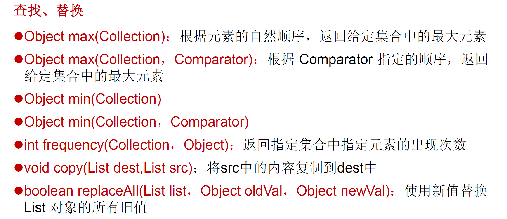

# 集合类概述
```
Java集合类可以用于存储数量不等的多个对象，还可以用于保存具有映射关系的关联数组
Collection接口：单列数据
    List：元素有序、可重复的集合
    Set：元素无序、不可重复的集合
Map：双列数据，具有映射关系“key-value对”
```
Collection接口继承树：


# Collection接口
```
1.Collection接口是List，Set，Queue接口的父类，该接口定义的方法可以操作Set，List和Queue集合
2.JDK不提供Collection的直接实现类，而是提供其子接口的实现类
3.JDK5.0之前，Java会丢失容器中所有对象的数据类型都当作Object处理，JDK5.0增加了泛型，Java可以记住容器中对象的数据类型
```

# Iterator迭代器接口
```
1.Iterator对象称为迭代器（设计模式的一种），主要用于遍历Collection集合中的元素
2.GOF给迭代器的定义：提供一种方法访问一个容器对象中各个元素，而不暴露该对象的内部细节
3.Collection接口继承了java.lang.Iterable接口，该接口有一个iterator()方法，所有实现了Collection接口的集合都有一个iterator()方法，用以返回一个实现了Iterator接口的对象
4.仅用于遍历集合，Iterator本身不提供承装对象的能力
5.每次调用iterator()都会得到一个全新的迭代器，默认游标在集合的第一个元素之前
```
Iterator接口方法：

next():1.指针下移   2.将下移以后集合位置上的元素返回

# foreach
JDK5.0提供了foreach循环迭代访问<font color=red>Collection</font>和<font color=red>数组</font>  
遍历不需要获取Collection或数组长度  
底层调用<font color=red>Iterator</font>完成操作，例子：
```
for(Person person:persons){
    System.out.println(person.getName());
}
```

# List接口
<font color=red>元素有序（和存入时的顺序相同）、且可重复</font>，即每个元素都有其对应的顺序索引  
常用的实现类：ArrayList，LinkedList和Vector  
List接口方法：


# ArrayList
```
List的主要实现类，线程不安全，效率高，底层使用Object[]
```
JDK7源码分析：
```
ArrayList list = new ArrayList(); //底层创建了长度是10的Object[]数组
默认情况下，添加的时候导致底层数组容量不够，则扩容成原来容量的1.5倍，同时需要数组复制操作
```
JDK8源码分析：
```
ArrayList list = new ArrayList(); //底层没有创建数组，当使用添加操作后才创建长度为10的数组
```

# LinkedList
```
双向链表，内部没有声明数组，定义了Node类型的first和last记录首末元素，定义内部类Node作为保存数据的基本结构，Node中还有prev和next分别记录上一个和下一个元素的位置
```

# Vector
```
线程安全，效率低，底层使用Object[]，JDK1.0时存在
在JDK7和8中，Vector()创建对象时，都创建长度为10的数组，扩容时为原数组的2倍
当需要线程安全时一般都会使用List的synchronizedList方法返回一个线程安全的List，而不适用Vector
```

# ArrayList，LinkedList和Vector的异同


# Set接口
<font color=red>储存无序的（不是随机性，底层数组根据哈希值的顺序排列，而非加入时的顺序）</font>，<font color=red>不可重复</font>的数据
```
同样为Collection的子接口，Set接口没有额外的方法
Set集合不允许包含相同的元素，判断两个对象是否相同时是使用equals方法
```

# HashSet

HashSet是Set接口的经典实现，大部分时候都是用此类
特点：
```
1.元素根据哈希值排序
2.线程不安全
3.元素可以是null
4.初始容量16，若使用率超过0.75，就会扩大到原来的2倍
```
添加元素的过程：
```
先调用元素a的hashCode()方法，通过hash值得到在数组中存放的位置：
1.判断位置上是否有元素，若无，则直接添加
2.若有元素，比较两个的hash值，若不同，则添加
3.若相同，则调用a的equals方法，若false则添加，若相同则添加失败（jdk7：a放入数组中，指向原元素。jdk8：原元素指向a）
PS：通过链表的方式在数组的同一个位置添加元素
```

# hashCode()和equals()
```
1.向Set中添加数据，所在的类一定要重写hashCode()和equals()方法
2.两个方法要保证一致性：相等的对象必须具有相等的散列码
技巧：equals()用到的属性，hashCode()中都必须用到
```

# LinkedHashSet
```
同样也是无序的，但是可以按照传入的顺序遍历（因为链表结构）
在添加数据的同时，每个数据维护了两个引用记录数据前后加入的数据位置
适合频繁遍历数组的操作
```

# TreeSet
```
TreeSet是SortedSet接口的实现类，可以确保集合元素处于排序状态
底层使用红黑树结构储存数据
```
两种排序方法：<font color=red>自然排序（实现Comparable接口），定制排序（Comparator）</font>
```
自然排序：比较两个对象的标准是compareTo()返回0，不再是equals()
定制排序：比较两个对象的标准是compare()返回0，不再是equals()
TreeSet的查询速度比List快
```

# MAP
```
1.MAP与Collection并列存在，用于保存具有映射关系的数据key-value
2.key和value可以是任何数据类型
3.key用Set存放，不允许重复，即同一个map对象所对应的类，需重写equals()和hashCode()
4.通常key存放String
5.常用实现类：HashMap（使用频率最高），TreeMap，LinkedHashMap，Properties
6.Entry：key-value对
```
Map结构理解：
```
key：无序的，不可重复的，使用Set存储，需重写hashCode()和equals()
value：无序，可重复，使用Collection储存，需重写equals()
entry：无序，不可重复，使用Set储存
```
Map常用方法：


# HashCode底层实现原理
JDK7：
```
new HashMap(); // 创建长度为16的一维数组Entry[] table
map.put():
1.计算key1的hashCode()，得到Entry存放的位置
2.若位置上为空，则添加成功
3.若不为空，比较key1和该位置上的数据的哈希值
4.若都不同，添加成功
5.若与其中一个数据相同，使用equals比较
6.若equals返回false，则继续遍历直到完成一轮，若true，使用value1替换value2
当储存的Entry数目超出临界值，并且对应数组索引位置上为空，扩容：2倍（为了提高查询的效率）
```
JDK8：
```
new HashMap():底层没有创建一个数组，数组类型为Node，而非Entry
put()：底层创建长度为16的数组
底层结构：数组+链表+红黑树
当数组某一个索引位置上元素链表长度大于8，并且当前数组长度大于64
此时此索引位置上的所有数据改为使用红黑树储存
DEFAULT_INITIAL_CAPACITY：HashMap的默认值为16
DEFAULT_LOAD_FACTOR：HashMap的默认加载因子0.75
threshold：扩容的临界值=容量*填充因子=12
TREEIFY_THRESHOLD：链表长度大于该默认值，转化为红黑树：8
MIN_TREEIFY_CAPACITY：数组中转换成树时的长度最小值：64
```

# LinkedHashMap
```
在HashMap的基础上，使用一对双向链表记录添加元素的顺序
```

# TreeMap
```
内部对key-value排序，底层使用红黑树存储数据
Key的排序：自然排序（Comparable接口）和定制排序（Comparator对象）
```

# HashTable
```
JDK1.0提供，古老的实现类，线程安全，效率低不能储存null
```

# Properties
```
Hashtable的子类，用于处理属性文件
属性文件里的key和value都是字符串类型，所有Properties里的key和value都是字符串类型
需配合FileStream使用，使用getProperity和setProperity方法
```

# Collections工具类
```
是一个操作Set，List和Map等集合的工具类
```


