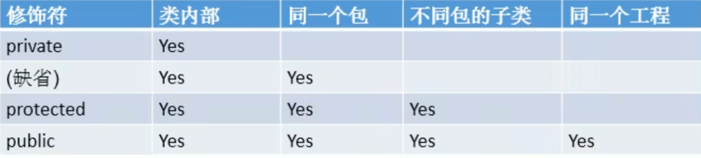
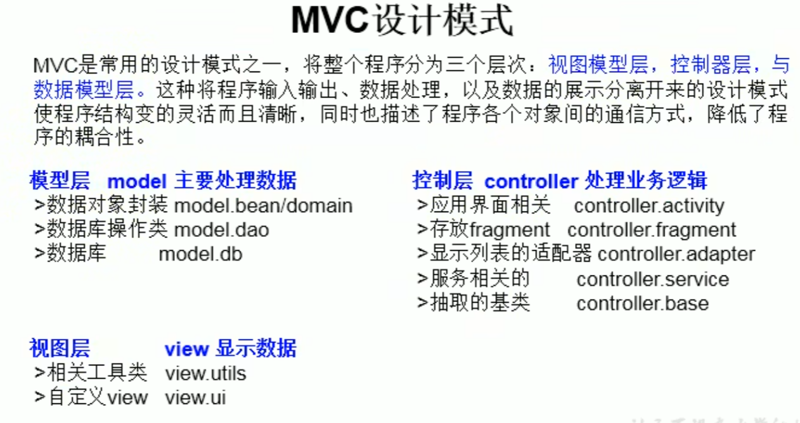
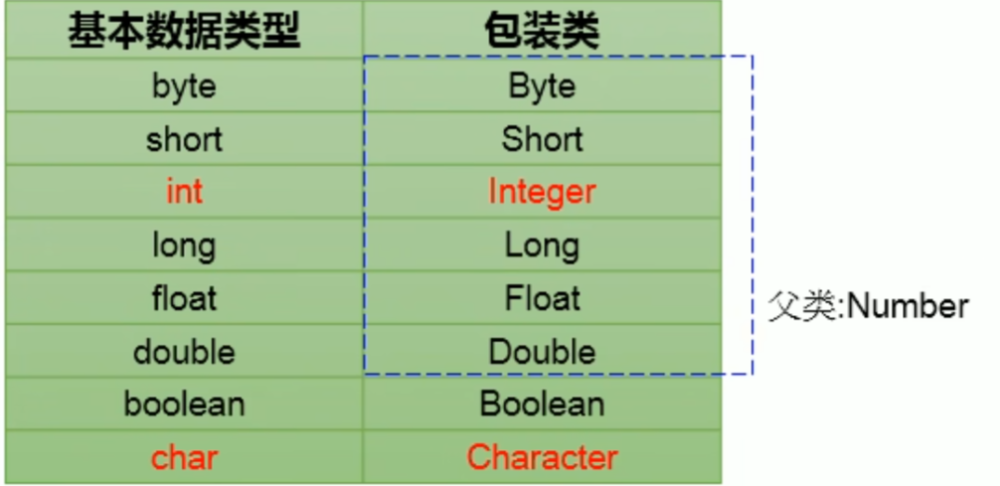
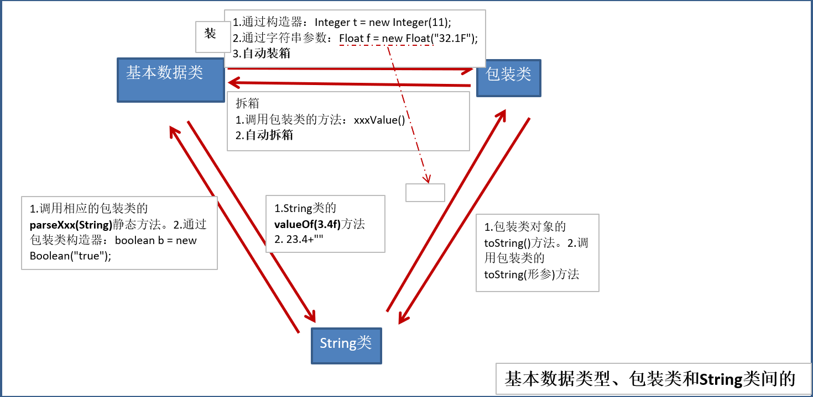

# 类和对象的概念
```
类：对一类事物的描述，抽象，概念上的定义
对象：实际存在的该类事物的个体，也称为实例(instance)
```

# 类的成员
属性(Field)：成员变量  
方法(Method)：函数

# 类的赋值
```
对于类赋值操作：class c2 = c1;
相当于是将c1的地址赋值给了c2
```

# 类、对象的内存解析
```
栈(stack)：指虚拟机栈，用于存储局部变量，存放了编译期可知长度的各种基本数据类型（boolean，int，short，long，float，double，char）、对象引用（reference类型，对象堆内存存放的首地址）
堆(heap)：存放对象实例和数组
方法区(Method Area)：被虚拟机加载的类信息，常量，静态变量，及时编译器编译后的代码
```

# 属性（成员变量）和局部变量的异同
相同点：
```
定义格式相同
先声明后使用
都有作用域
```
不同点：
```
1.声明的位置不同：
属性：定义在类中
局部变量：定义在方法中，形参，代码块，构造器中
2.修饰权限符不同：
属性：可以使用权限修饰符：private，public，缺省，protected
局部变量：无权限修饰符
3.默认初始化值：
属性：每个类型都有其默认初始化值
局部：无
4.内存中位置：
属性：堆空间（非static）
局部：栈空间
```

# 方法的声明
```
权限修饰符 返回值类型 方法名（形参列表）{  
    方法体  
}
可以添加static，final，abstract等来修饰方法
```

# 匿名对象
```
创建对象时，没有显式的赋值给一个变量名
特征：匿名对象只能调用一次
例子：new Phone.sendmail();
```

# 方法重载(overload)
```
在同一个类中，允许存在一个以上的同名方法，只要他们的参数个数或者参数类型不一样
调用时，根据参数列表的不同来区别每个方法
```

# 可变个数形参
```
JavaSE5.0中提供了Varargs(Variable number of arguments)允许直接定义能和多个实参相匹配的形参，从而以更简单的方式传递个数可变的实参，例如：
public static void test(int a, String ... book)：声明中，Varargs必须声明在末尾，且最多声明一个可变形参（因为编译器无法理解参数的匹配）
此方法和其他不同参数列表的同名方法也能构成重载，但是不能和同类型数组形参构成重载
所以Varargs与数组形参的区别是：数组形参的传参必须是数组类型（例如String必须先new一个String数组作为传参才行）而Varargs则可以直接传入多个参数不需要通过new创建数组
调用形参：与数组的调用相同
```

# 方法参数的值传递机制
__形参：__ 方法声明时的参数  
__实参：__ 方法调用时实际传给形参的参数值  
Java方法中参数传递方式只有一种：<font color=red>值传递</font>（将实际参数值的副本传入方法内，参数本身无影响）  
基本数据类型：数据值的复制  
引用数据类型：地址值的复制  
<font color=red>上述内容中对于string是不一样的：</font>String保存的地址是指向字符串常量池中的，如果更改String中的内容，则相当于修改String中的地址值重新指向另外一个字符串

# println(char[]) 与 println(Object)
该方法会遍历输出char中的所有元素，而其他数组类型则会直接输出地址值

# 封装性
```
隐藏对象内部的复杂性，只对外公开简单的接口，从而提高系统的可扩展性、可维护性，这就是封装的设计思想
“高内聚，低耦合”：
高内聚：内部数据操作细节自己完成，不允许外部干涉
低耦合：仅对外暴露少量方法用于使用

问题引入：
创建对象时，可以通过“对象.属性”的方法赋值，但是直接赋值会有约束与限制条件，所以大部分情况下都是通过调用方法对属性进行赋值，同时为了避免用户使用“对象.属性”进行赋值，需要将属性声明为private权限

封装性的体现：
私有化(private)属性后，提供公共(public)的方法get与set来获取与设置属性值
```

# 权限修饰符
```
Java的四种权限修饰符（从小到大）：private，缺省，protected，public
可以用于修饰：属性，方法，构造器，内部类
```


# class权限修饰符
```
public：任意位置被访问
缺省：被同一个包内部类访问
```

# 构造器(constructor)
```
如果没有显式的定义，系统默认提供一个空参的构造器
格式：权限修饰符 类名(形参列表){}
```

# JavaBean
```
JavaBean是一种Java语言写成的可重用组件
所谓的JavaBean就是符合下述标准的Java类
1.类是公共的
2.有一个无参的公共的构造器
3.有属性，且有get、set方法
```

# UML类图
```
UML(unifield Modeling Languge)设计软件的可视化建模模型
类图：显示了模型的静态结构，特别是模型中存在的类、类的内部结构以及它们与其他类的关系等
UML类图：包含类名、属性(field) 和方法(method) 且带有分割线的矩形来表示
其中+表示public，-表示private，表示protected
```

# this
```
this：用于指示当前对象 或 当前正在创建的对象
在类方法中，使用"this.属性"，"this.方法"的方式调用，不过一般会省略，但是当形参与属性重名时就一定要使用this
this调用构造器：
在类构造器中，可以显式使用"this(形参列表)"方式，调用本类中的其他构造器。规定：调用this()构造器必须在当前构造器的首行，且最多只能调用一次this()
```

# package包
```
1.为了实现更好的项目中类的管理，提供包的概念（文件系统层级概念）
2.使用package关键字声明类或接口所属的包，声明要在文件的首行
3.包属于标志符，需遵循包的命名规则，规范(xxyyzz)
4.每'.'代表一层文件目录
ps：同一个包下不能有同名类和接口，不同包下可以有
```

# JDK中主要的包
```
java.lang：Java语言的核心类，如String，Math，System，Thread提供常用功能
java.net
java.io
java.util：实用工具类，定义系统特性，接口集合框架类，使用与日期日历相关的函数
java.text：java格式化相关的类
java.sql
java.awt：(abstract window toolkits)抽象窗口工具集，用来构建和管理GUI
```

# MVC设计模式
```
MVC(model View Control)是一种常用设计模式之一，整个程序分为三个层次：视图模型层，控制器层。使得程序输入输出，数据处理，数据的展示分开来，使程序结构更加灵活，同时描述了程序各个对象的通信方式，降低程序的耦合性

模型层：model主要处理数据
>数据库对象封装 model.bean/domain
>数据库操作类 model.dao
>数据库 model.db

控制层：controller处理业务逻辑
>应用界面相关 controller.activity
...
```


# import
```
import：导入
1.在源文件中显示使用import结构导入指定包下的类、接口：import java.lang.*
2.位置：声明在包的声明和类的声明之间
3.如果需要导入多个类和接口，就并列使用多个import语句
4.一次性导入util包下的所有类或接口：import java.util.*
5.如果导入的类或接口是java.lang包下的，或是当前包下的，无需import
6.在代码中使用不同包下的同名类，则需要使用类的全名指明调用
7.如果已经导入java.a包下的类，还需要使用a包下子包的类，则需要导入（我的附属的附属不是我的附属）
8.import static组合使用：调用指定类或接口下的静态属性或方法，例如import static java.lang.System.*;(注意一定需要*,import static后面不接包)
```

# 继承
```
格式：class A extends B{}
A：子类，派生类，subclass
B：父类，超类，基类，superclass
体现：一旦子类A继承父类B，A就获取了B中的所有属性和方法特别的，父类中声明的private属性和方法，子类也有，但是因为封装性的影响，子类不能直接调用父类的结构
    子类还能声明自己的属性和方法，实现扩展
好处：减少代码冗余，提高复用性，便于扩展，为后续多态性提供前提
```
关于继承的<font color=red>规定</font>：
```
1.一个类可以被多个子类继承
2.Java中类的单继承：一个类只能有一个父类
3.子类直接继承的父类称为：直接父类，父类的父类称为：间接父类
4.子类拥有所有父类的所有属性和方法
5.子类存在同名属性的情况，看对象实例是哪个类型，根据对象实例先寻找自己实例下的同名属性
```
<font color=red>Object</font>
```
1.如果没有显示声明一个类的父类，则此类继承与java.lang.Object
2.所有java类（除java.lang.Object类之外）都直接或间接继承于java.lang.Object类
3.所有java类都具有java.lang.Object类声明的功能
```

# 方法重写(override/overwrite)
定义：
```
子类对父类中继承而来的方法进行改造，也称为方法的重置、覆盖
注意：属性没有重写的说法，父类和子类同名属性同时存在
```
要求：
```
1.重写方法必须和父类的方法同名，同参数列表
2.被重写方法是基本数据类型，重写方法也得是相同的基本数据类型
  被重写方法返回值是A类型，重写方法返回值可以是A类和A的子类
  被重写方法返回值是void，重写方法返回值也得是void
3.重写的方法访问权限不能小于父类方法的访问权限（子类不能重写父类的private方法）
4.子类方法抛出的异常不能大于父类方法的异常（子类的异常必须是父类异常同类或子类）
PS：子类与父类中同名同参方法必须同时声明为非static，或者同时为static（非重写），因为static方法属于类，子类无法覆盖父类的方法
```

# super关键字
```
super：理解为父类，可以用来调用父类的属性，方法和构造器
```
特殊情况使用：
```
当子类和父类定义了同名属性时，需要用super调用父类的属性
当子类重写了父类的方法时，必须显式使用super调用父类的方法
```
super构造器的使用：
```
1.可以在子类构造器中显式使用"super(形参列表)"的方式调用父类构造器
2."super(形参列表)"必须声明在子类构造器首行
3.在构造器中，this()和super()只能二选一，不能同时出现
4.在构造器首行，没有显示调用this()或super()，则默认调用父类中空参的构造器
5.在类的构造器中，至少有一个构造器中使用了"super()"，调用了父类构造器
```

# 子类对象实例化的全过程
从结果上来看：
```
子类继承父类后，获得了父类中声明的属性和方法
创建子类对象，堆空间中就会加载父类声明的属性
```
从过程上来看：
```
子类使用构造器创建对象时，一定会间接或直接使用父类的构造器，进而调用父类的父类的构造器，知道调用了Object的空参构造器为止。因为加载了所有父类的结构，所以内存中才能看到父类的结构，从而调用父类的方法。
```

# 多态性
概念：
```
父类引用指向子类的对象
```
特点：
```
在编译器，只能调用父类中声明的方法，在运行期，执行的是子类重写的方法（编译看左，运行看右）
多态性只适用于方法，不适用于属性（编译和运行都看左边）
```

# 虚拟方法调用（Virtual Method Invocation）
```
虚拟方法：在多态情况下，对于重写的方法，父类的方法称为虚拟方法，因为在运行阶段实际上调用的是子类的方法，而编译阶段是无法确定的
动态绑定：编译时为父类方法，运行时为子类方法
```
<font color=red>多态是运行时行为</font>

# 从编译角度看重载与重写
```
对于重写：编译器根据参数列表的不同确定每一个方法，所以在编译阶段已经确定调用地址，称之为“早绑定”和“静态绑定”
对于多态（基于重写）：只有到方法调用的那一刻才确定具体的调用地址，这称之为“晚绑定”或“动态绑定”
```

# 向下转型
```
对于多态，由于变量为父类无法使用子类特有的属性和方法，但是实际上内存中已经加载了子类特有的属性和方法，为了解决这个问题，使用向下转型重新转变为子类类型：
子类 c1 = (子类)f1（其中f1类型为c1的父类多态）
不过强制转换时也会出现ClassCastException异常（由于不确定多态中原始的子类类型，强转时会转换错误）
```

# instanceof
```
A instanceof B：判断A是否是B的实例，如果是，返回true，如果不是，返回false
为了避免转换时出现错误，需要用instanceof判断判断
如果a instanceof A返回true，则a instanceof B也返回true（B是A的父类）
```

# Object类
```
Object类是所有Java的根父类，如果类的声明中未使用extends关键字，则默认父类为java.lang.Object
内容：
属性：无
构造器：只有一个空参构造
方法：equals，toString，getClass，hashCode，clone，finalize，wait，notify，notifyAll
finalize：当对象没有被其他任何变量引用时，JVM会在垃圾回收前调用finalize方法，程序员可以通过System.gc()或者Runtime.getRuntime().gc()来通知系统进行垃圾回收，会有效果，但是不一定立刻执行
```

# ==和equals()的区别
==
```
基本数据类型：比较保存的值是否相等（不需要类型相同）
引用数据类型：比较两个对象的地址是否相等，即是否引用同一个实体
```
equals
```
方法，只能用于引用数据类型
Object中equals的定义：return this==obj
说明Object中equals()和==的作用是相同的，比较两个对象地址值是否相同
而对于String，Date，File这些都重写了equals方法，重写后用于比较两个对象的“实体内容”是否相同
所以需要重写equals方法（一般直接调用IDE生成，完善）
```

# toString
```
toString在Object中定义的，返回值为String类型，返回类名和它的引用地址（这个地址是JVM设置的地址，与物理内存地址不同）
1.当使用print输出时，实际上是调用当前对象的toString()方法
2.Object中toString的定义：
return getClass().getName() + "@" + Integer.toHexString(hashCode());
3.String，Date，File，包装类等都重写了toString方法，使得调用时返回“实体内容”
```

# Java单元测试
```
1.选中当前工程 - 右键选择：build path - add libraries - JUnit 4 - 下一步
2.创建Java类，进行单元测试，要求：类为public，此类提供公共的无参构造器
3.此类中声明单元测试方法，权限为public，没有返回值，没有形参
4.此单元测试方法上需要声明注解，@Test，并在单元测试类中导入，import org.juint.Test
5.在方法内编写相关测试代码
6.写完后，双击方法名，右键run as - JUnit Test
PS；在eclipse中，直接加@Test注解能够直接配置Junit环境
```

# 包装类(Wrapper)
```
包装类（封装类）：针对八种基本数据类型定义相应的引用类型，拥有类的特点，可以调用类的方法，从而实现面向对象
对于Boolean包装类的初始化值为null（不是false）
```

包装类、String、基本数据类型之间的转换


# 自动装箱和自动拆箱
```
JDK5.0新特性
自动将基本数据和包装类转换
所以可将基本数据类型和包装类看做一个整体，他们之间等价
所以这个整体与String的转换方式：
基本数据类型、包装类-->String：调用String重载的valueOf()方法
String-->基本数据类型、包装类：调用包装类的parseXxx()方法
```

# static
```
可以用来修饰：属性，方法，代码块，内部类
对于属性：静态属性（类变量） vs 非静态属性（实例变量）
实例变量：每一个对象独立拥有一套实例变量
类变量：多个对象共享一个静态变量
```
静态变量说明：
```
1.静态变量随着类加载而加载（在对象创建前就加载在内存中），可以通过“类.静态变量”调用
2.存在于方法区的静态域中
3.调用规则：
        类变量  实例变量
类       yes      no
对象     yes      yes

方法区：类的加载信息，静态域，常量池
```
静态方法说明：
```
1.随着类的加载加载，通过“类.静态方法”调用
2.调用规则：
        类变量  实例变量
类       yes      no
对象     yes      yes
3.在静态方法中只能使用静态属性和方法
在非静态方法中，都可以调用
4.在静态方法中，不能使用this和super关键字
```

# 设计模式
```
在大量的实践中总结和理论化之后优选的代码结构、编程风格以及解决问题的思考方式：“套路”
```

# 单例设计模式
```
单例设计模式：采取一定方法使软件中某个类只能存在一个对象实例，并且只提供一个获得其对象实例的方法
```
具体操作1（饿汉式）：
```
1.类的构造器声明为private，及无法在外部用new新建对象
private Bank() {}
2.在内部新建一个实例对象（也是唯一的对象）
private(必须通过方法调用) static Bank instance = new Bank();
3.提供公共的方法，返回类的对象
public(外部可访问) static(外部无法创建对象调用方法，所以必须声明为static) Bank getInstance(){
  return instance;
}
4.创建的对象必须为为static的
private(必须通过方法调用) static(getInstance方法为静态，只能调用静态的属性) Bank instance = new Bank();
```
具体操作2（懒汉式）：
```
内部实例对象创建：private static Bank instance = null;
调用方法时再创建对象：
public static Bank getInstance(){
  if (instance == null)
    instance = new Bank();
  return instance;
}
```
饿汉式和懒汉式的区别:
```
饿汉式：好处：线程安全的
       坏处：对象加载时间过长（类导入就创建，占用内存时间久）
懒汉式：好处：延迟对象创建
        线程不安全（可以通过代码改进）
```
单例模式的优点：
```
减少了系统性能开销，当一个对象产生需要比较多的资源时，如读取配置，产生其他依赖对象，可以直接在启动时在内存中产生一个单例对象，永久驻留内存来解决
```
应用场景：
```
1.网站的计数器：不然难以同步
2.应用程序的日志应用：共享的日志文件只有一个，只能有一个实例去操作
3.数据库连接池
4.读取配置文件的类
5.Application
6.Windows Task Manager（任务管理器）
7.Windows Recycle Bin（回收站）
```

# 类的成员：代码块
```
1.代码块的作用：初始化代码块、对象
2.代码块只能用static修饰
静态代码块：
>内部可以有输出语句
>随着类的加载而执行，且只能执行一次
>作用：初始化类的信息
>如果定义了多个静态代码块，按照声明的先后顺序执行
>静态代码块的执行要优先于非静态代码块的执行
>静态代码块只能调用静态属性和方法，不能调用非静态结构

非静态代码块：
>内部可以有输出语句
>随着对象的创建而执行
>每创建一个对象，就执行一次非静态代码块
>作用：创建对象时，对对象的属性进行初始化
>如果一个类中定义了多个代码块，根据声明的先后顺序执行
>都可调用
```

# 类赋值顺序
```
1.默认初始化
2.显示初始化 / 5.代码块中赋值
3.构造器初始化
4.创建完对象后，通过.方法和.属性赋值
```

# final关键字
```
可以用来修饰：类、方法、变量
final修饰类：此类不能被其他类继承（最终的类），例如：String类，System类，StringBuffer类
final修饰方法：表示此方法不能够被重写，比如Object中的getClass()类
final修饰变量：表示为常量
    final修饰属性，可以初始化的位置：显示初始化，代码块初始化，构造器中初始化
    final修饰局部变量：尤其是形参时，表明不可以对形参进行修改
注意：对于public void addOne(final Other o){
              o.i++;
          }
是可行的，因为final只是限制o不能引用其他的Other对象，但是o的属性可以修改
```

# 抽象类
abstract可以用来修饰：类、方法  
修饰类：
```
1.此类不能实例化
2.抽象类中一定要有构造器，便于子类实例化时调用
3.开发中，会提供抽象类的子类，让子类实例化，完成相关操作
```
修饰方法：
```
1.抽象方法只有方法的声明，没有方法体
2.包含抽象方法的类，一定是一个抽象类，反之抽象类中可以没有抽象方法
3.若子类重写了父类中的所有抽象方法后，子类可实例化
  若子类没有重写，那也是一个抽象类，需要用abstract修饰
```
注意点：
```
abstract不能用来修饰：属性和构造器等结构
abstract不能用来修饰私有方法、静态方法、final方法、final类
```
抽象类的匿名类：
```
方法1：
Person p = new Person(){
  @Override
  public void eat() {
    sys....
  }

  @Override
  public void breath(){
    sys...
  }
}
方法2：
method(new Person(){
  @Override
  public void eat() {
    sys....
  }

  @Override
  public void breath(){
    sys...
  }
})
相当于是使用抽象类直接重写内部的抽象方法，而不通过编写子类代码继承重写方法，简化开发流程
```
# 模板方法设计模式
```
在软件开发中去实现一个算法，整体步骤固定，可以在父类中写好，但是某些部分易变，易变的部分抽象出来，供不同子类去实现，这就是模板模式
```

# 接口
```
使用interface定义
在Java中，接口和类是并列的两个结构
定义接口：
3.1 JDK7及以前：只能定义全局常量和抽象方法
			>全局常量：public static final的.但是书写时，可以省略不写
			>抽象方法：public abstract的
3.2 JDK8：除了定义全局常量和抽象方法之外，还可以定义静态方法、默认方法（略）
4. 接口中不能定义构造器的！意味着接口不可以实例化 
5. Java开发中，接口通过让类去实现(implements)的方式来使用.
   如果实现类覆盖了接口中的所有抽象方法，则此实现类就可以实例化
   如果实现类没有覆盖接口中所有的抽象方法，则此实现类仍为一个抽象类
    
6. Java类可以实现多个接口   --->弥补了Java单继承性的局限性
   格式：class AA extends BB implements CC,DD,EE
7. 接口与接口之间可以继承，而且可以多继承
8. 接口的具体使用，体现多态性
9. 接口，实际上可以看做是一种规范
```

# 代理模式 & 工厂模式
```
是Java开发中使用较多的一种设计模式。代理设计就是为其他对象提供一种代理以控制对这个对象的访问。
```

# Java8中关于接口的改进
```
Java 8中，你可以为接口添加静态方法和默认方法。从技术角度来说，这是完全合法的，只是它看起来违反了接口作为一个抽象定义的理念。
静态方法：
使用static关键字修饰。可以通过接口直接调用静态方法，并执行其方法体。我们经常在相互一起使用的类中使用静态方法。你可以在标准库中找到像Collection/Collections 或者 Path/Paths 这样成对的接口和类。
默认方法：
默认方法使用 default 关键字修饰。可以通过实现类对象来调用。我们在已有的接口中提供新方法的同时，还保持了与旧版本代码的兼容性。
比如：java 8 API 中对 Collection 、 List 、 Comparator 等接口提供了丰富的默认方法。
调用接口中的默认方法：接口名.super.方法()
```

# 内部类
在 Java 中，允许一个类的定义位于另一个类的内部，前者称为<font color=red>内部类</font>，后者称为<font color=red>外部类</font>
```
内部类的分类：
成员内部类（静态、非静态）  vs 局部内部类(方法内、代码块内、构造器内)

3.成员内部类：
	一方面，作为外部类的成员：
		>调用外部类的结构
		>可以被static修饰
		>可以被4种不同的权限修饰

		另一方面，作为一个类：
		> 类内可以定义属性、方法、构造器等
 		> 可以被final修饰，表示此类不能被继承。言外之意，不使用final，就可以被继承
 		> 可以被abstract修饰

4.关注如下的3个问题
  4.1 如何实例化成员内部类的对象
        // 创建Dog实例(静态的成员内部类):
		Person.Dog dog = new Person.Dog();
		//创建Bird实例(非静态的成员内部类):
		Person p = new Person();
		Person.Bird bird = p.new Bird();
  4.2 如何在成员内部类中区分调用外部类的结构
        Person.this.eat();  //调用外部类的非静态属性
        System.out.println(name);//方法的形参
		System.out.println(this.name);//内部类的属性
		System.out.println(Person.this.name);//外部类的属性
  4.3 开发中局部内部类的使用  见InnerClassTest1.java
        //创建一个实现了Comparable接口的类:局部内部类
		方式一：
		class MyComparable implements Comparable{
			@Override
			public int compareTo(Object o) {
				return 0;
			}
		}
		return new MyComparable();
		
		//方式二：
		return new Comparable(){

			@Override
			public int compareTo(Object o) {
				return 0;
			}
			
		};

5. 在局部内部类的方法中（比如：show）如果调用局部内部类所声明的方法(比如：method)中的局部变量(比如：num)的话,要求此局部变量声明为final的。
	jdk 7及之前版本：要求此局部变量显式的声明为final的
	jdk 8及之后的版本：可以省略final的声明
```

# 异常
```
在Java语言中，将程序执行中发生的不正常情况称为异常（语法和逻辑错误不是异常）
异常可以分为两类：
Error：Java虚拟机无法解决的验证问题：JVM系统内部错误、资源耗尽等如StackOverflow和OOM，一般不编写针对代码
Exception：因为其他编程错误或偶然的外在因素导致的一般性问题，可以使用针对性代码处理：空指针访问，读取不存在文件，网络连接中断，数组角标越界
```
异常体系结构：
```
java.lang.Throwable
 		|-----java.lang.Error:一般不编写针对性的代码进行处理。
 		|-----java.lang.Exception:可以进行异常的处理
 			|------编译时异常(checked)
 					|-----IOException
 						|-----FileNotFoundException
 					|-----ClassNotFoundException
 			|------运行时异常(unchecked,RuntimeException)
 					|-----NullPointerException
 					|-----ArrayIndexOutOfBoundsException
 					|-----ClassCastException
 					|-----NumberFormatException
 					|-----InputMismatchException
 					|-----ArithmeticException
```
异常的处理：抓抛模型
```
过程一："抛"：程序在正常执行的过程中，一旦出现异常，就会在异常代码处生成一个对应异常类的对象。
           并将此对象抛出。
           一旦抛出对象以后，其后的代码就不再执行。
 		
 		关于异常对象的产生：① 系统自动生成的异常对象
 					 ② 手动的生成一个异常对象，并抛出（throw）
 
过程二："抓"：可以理解为异常的处理方式：① try-catch-finally  ② throws
```

# try-catch-finally
```
try{
	//可能出现异常的代码

}catch(异常类型1 变量名1){
		//处理异常的方式1
}catch(异常类型2 变量名2){
		//处理异常的方式2
}catch(异常类型3 变量名3){
		//处理异常的方式3
}
....
finally{
		//一定会执行的代码
}
```
说明：
```
1. finally是可选的。
2. 使用try将可能出现异常代码包装起来，在执行过程中，一旦出现异常，就会生成一个对应异常类的对象，根据此对象的类型，去catch中进行匹配
3. 一旦try中的异常对象匹配到某一个catch时，就进入catch中进行异常的处理。一旦处理完成，就跳出当前的try-catch结构（在没有写finally的情况）。继续执行其后的代码
4. catch中的异常类型如果没有子父类关系，则谁声明在上，谁声明在下无所谓。catch中的异常类型如果满足子父类关系，则要求子类一定声明在父类的上面。否则，报错
5. 常用的异常对象处理的方式： ① String  getMessage()    ② printStackTrace()
6. 在try结构中声明的变量，再出了try结构以后，就不能再被调用
7. try-catch-finally结构可以嵌套
 
体会1：使用try-catch-finally处理编译时异常，使得程序在编译时就不再报错，但是运行时仍可能报错。相当于我们使用try-catch-finally将一个编译时可能出现的异常，延迟到运行时出现。 
体会2：开发中，由于运行时异常比较常见，所以我们通常就不针对运行时异常编写try-catch-finally了。针对于编译时异常，我们说一定要考虑异常的处理。
```
finally的使用：
```
1.finally是可选的
2.finally中声明的是一定会被执行的代码。即使catch中又出现异常了，try中有return语句，catch中有return语句等情况。
3.像数据库连接、输入输出流、网络编程Socket等资源，JVM是不能自动的回收的，我们需要自己手动的进行资源的释放。此时的资源释放，就需要声明在finally中。
```

# throws
```
1. "throws + 异常类型"写在方法的声明处。指明此方法执行时，可能会抛出的异常类型。一旦当方法体执行时，出现异常，仍会在异常代码处生成一个异常类的对象，此对象满足throws后异常类型时，就会被抛出。异常代码后续的代码，就不再执行！    
2. 体会：try-catch-finally:真正的将异常给处理掉了。throws的方式只是将异常抛给了方法的调用者。并没有真正将异常处理掉。  
3. 开发中如何选择使用try-catch-finally 还是使用throws？
  3.1 如果父类中被重写的方法没有throws方式处理异常，则子类重写的方法也不能使用throws，意味着如果子类重写的方法中有异常，必须使用try-catch-finally方式处理。
  3.2 执行的方法a中，先后又调用了另外的几个方法，这几个方法是递进关系执行的。我们建议这几个方法使用throws的方式进行处理。而执行的方法a可以考虑使用try-catch-finally方式进行处理。
```