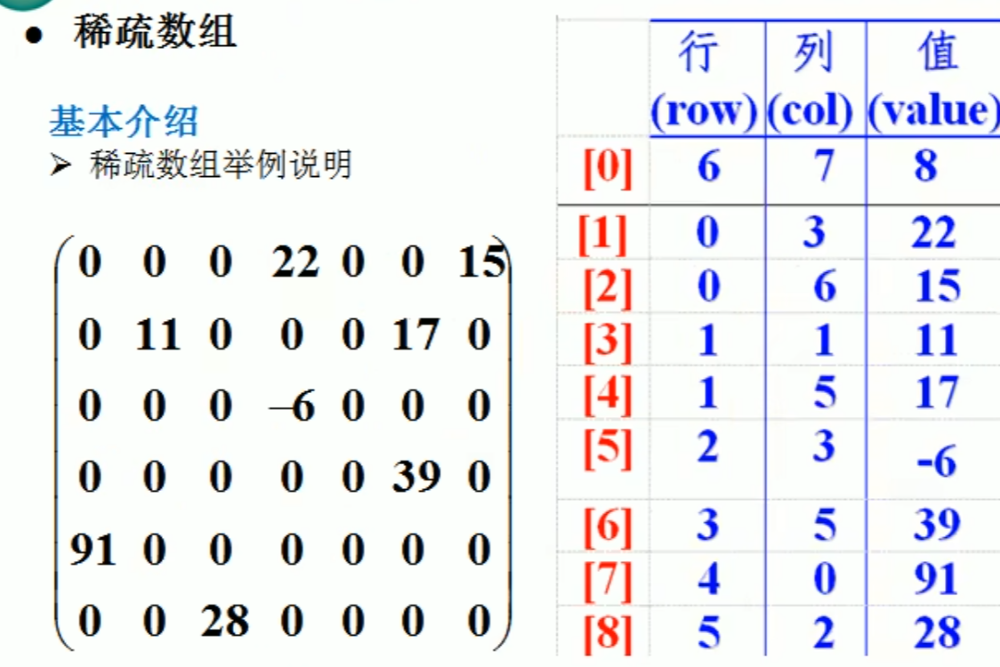

# 稀疏数组
结构思路：
```
1.记录数组一共有几行几列，有多少个不同的值
2.把具有不同值的元素的行列及值记录在一个小规模的数组中，从而缩小程序的规模
```
二维数组与稀疏数组的转换思路：
```
二维数组转稀疏数组：
1.遍历二维数组，得到有效数据的个数sum
2.根据sum就可以创建稀疏数组sparseArray int[sum+1][3]
    sum+1：除了每个有效数据之外，还要记录整个数组的行列数和有效数据数目
    3：记录行，列，有效值
3.将二维数组的有效数据存入到稀疏数组中

稀疏数组转二维数组：
1.读取稀疏数组的第一行，根据第一行的数据创建二维数组
2.读取后面每一行的数据，并赋值给二维数组
```